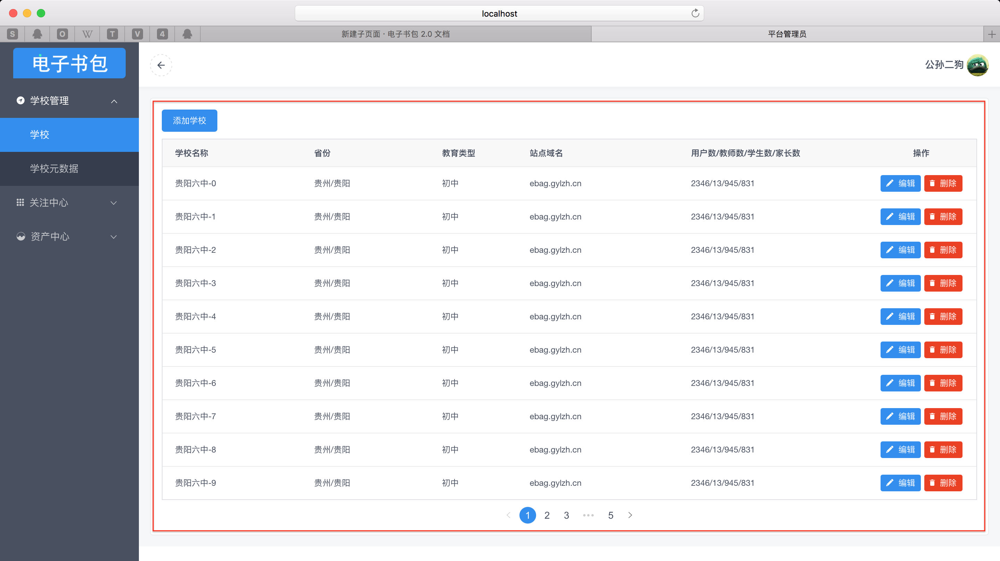

`main.vue` 是页面的框架，左边是侧边栏、右边顶部是工具状态栏、右边中间是子页面显示区。点击侧边栏的菜单项后在子页面的显示区显示对应子页面的内容 (Vue 里用 `<router-view/>` 加载)，图中红框中部分即是子页面显示区:



按照下面的三步增加新的子页面:

1. 在 `subpage` 目录 (可以是多层目录) 中创建子页面文件例如 `school/school-editor.vue`

   ```html
   <template>
       <div class="school-editor">
           <Button type="primary">{{ name }}</Button>
       </div>
   </template>

   <script>
       export default {
           data() {
               return {
                   name: '学校管理'
               };
           }
       };
   </script>

   <style lang="scss">

   </style>

   ```

2. 在 `router.js` 中注册子页面的路由

   ```js
   export default new Router({
       routes: [{
           path: '/',
           name: 'main',
           redirect: '/school',
           component: Main,
           children: [{
                   path: 'school',
                   name: 'school',
                   component: () => import('./subpage/school/school.vue')
               },
               {
                   path: 'school-editor/:id',
                   name: 'school-editor',
                   component: () => import('./subpage/school/school-editor.vue')
               }
           ]
       }],
   });
   ```

3. 在 `main.vue` 中增加此页面对应的菜单项 (可选)，`name` 为此子页面路由中的 `name`

   ```html
   <MenuItem name="school-editor">编辑学校</MenuItem>
   ```

   ​