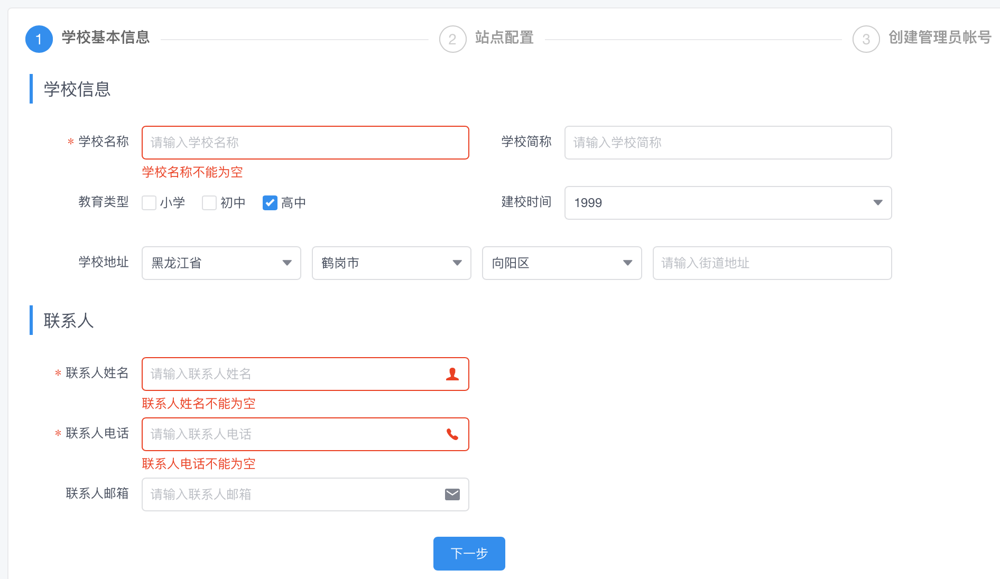

如图当表单验证不通过时提示用户需要填写的项:



iView 的表单 Form 基于 [ async-validator](https://github.com/yiminghe/async-validator) 提供了数据验证的功能，使用分如下几步:

1. `data()` 中定义表单要绑定的数据和验证规则
2. Form 表单中绑定数据和验证规则
3. 提交表单的时候调用 `validate()` 进行验证，通过则提交

## 表单数据和验证规则

```js
export default {
    data() {
        return {
            // 表单绑定的数据
            school: {
                name: '',
                contactPerson: ''
            },
            // 表单验证规则
            schoolRules: {
                name: [
                    { required: true, message: '学校名称不能为空', trigger: 'blur' }
                ],
                contactPerson: [
                    { required: true, message: '联系人姓名不能为空', trigger: 'blur' }
                ]
            }
        }
    }
}
```

## 定义表单

Form 使用 3 个属性:

* `ref`: 用于取得 Form 表单对象
* `:model`: 表单绑定的数据
* `:rules`: 表单验证的规则

FormItem 的 `prop` 指定要验证的属性

```html
<!-- 表单绑定数据 school，使用的教育规则为 schoolRules，他们都是在 data() 中定义的 -->
<Form ref="school" :model="school" :rules="schoolRules">
    <FormItem label="学校名称" prop="name"> <!-- 校验规则为 schoolRules.name -->
        <Input v-model="school.name"></Input>
    </FormItem>
    <FormItem label="联系人姓名" prop="contactPerson"> <!-- 校验规则为 schoolRules.contactPerson -->
        <Input v-model="school.contactPerson"></Input>
    </FormItem>
    <Button @click="submit">Submit</Button>
</Form>
```

## 提交表单

点击 Submit 按钮提交表单，在提交前先调用表单对象的 `validate()` 函数判断一下表单是否验证通过，通过则提交到服务器，否则不处理 (界面上会自动提示用户没有验证通过的项)

```java
export default {
    data() {
        ...
    },
    methods: {
        // 提交表单
        submit() {
            // 使用 ref 获取表单的对象，调用它的 validate() 进行校验
            this.$refs['school'].validate(valid => {
                // 验证通过 valid 为 true，否则为 false
                if (valid) {
                    $.rest.create(...); // 提交到服务器
                }
            });
        }
    }
}
```

## 参考资料

iView Form 的文档中有几个表单验证的例子，请参考 <https://www.iviewui.com/components/form>。